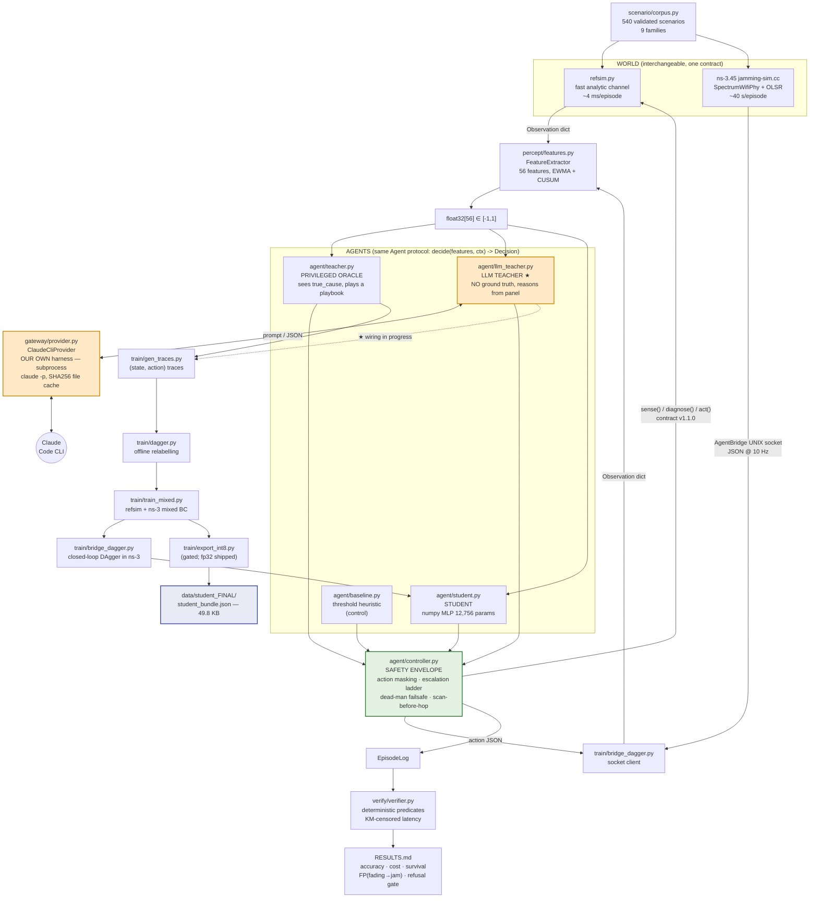
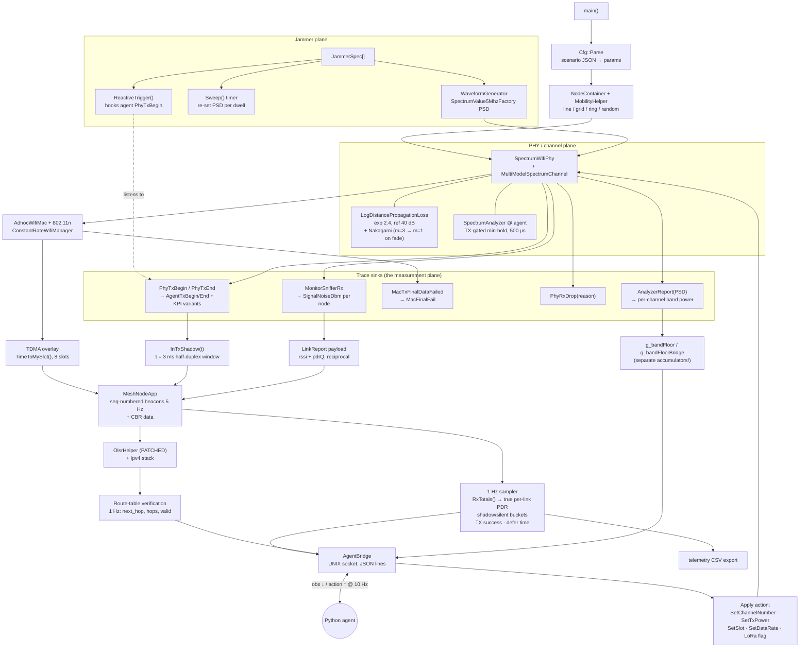
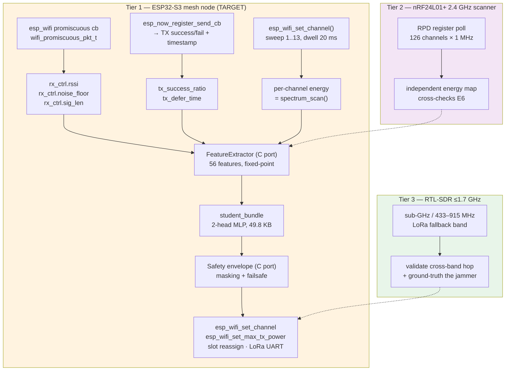

# ARCHITECTURE — Jamming Survival, On-Device Mesh Agent

**Status date:** 2026-09-11 · **Contract:** v1.1.0 (56 features, 9 hypotheses)
**Scope of this document:** what exists and runs *today*, drawn as dependency DAGs, plus a
protocol-by-protocol implemented / partial / missing ledger, the scenario construction
recipes, and the KPI → decision mapping.

Every claim in §1–§5 is traceable to a file in this repo. Anything not yet built is in
**§6 Gap ledger** and nowhere else — this document does not describe aspirations as facts.

---

## 0. The one-paragraph version

A drone is the root of a small 802.11 mesh. Its link degrades. **Something** caused that:
an attacker (barrage / spot / reactive / sweep jammer) or nature (multipath fading, a dead
neighbour, self-congestion, a hidden terminal). The two classes demand *opposite* responses
— channel-hopping away from fading is expensive and useless, and staying put under a spot
jammer is fatal. So the agent must **diagnose before it acts**, paying for evidence under a
hard budget, and must be *structurally* incapable of the expensive mistake. An **LLM teacher**
(Claude, reached through our own gateway — no LangChain, no LangGraph) reasons over a
telemetry panel and emits tool calls; a **12.8 K-parameter student** distilled from it runs
the same loop on-device at 49.8 KB.

---

## 1. Current architecture DAG — what works today



### 1.1 Link-by-link status

| # | Edge | State | Evidence |
|---|---|---|---|
| L1 | corpus → refsim | **WORKS** | 540/540 scenarios build & run |
| L2 | corpus → ns-3 | **WORKS** | 375 episodes, 0 crashes post-patch |
| L3 | refsim → features | **WORKS** | `xval_refsim_ns3.py` 37/40 gate |
| L4 | ns-3 → AgentBridge → features | **WORKS** | 10 Hz JSON, reproducible (39%/39% repeat) |
| L5 | features → oracle teacher | **WORKS** | 100% acc, 0.000 cost (it is privileged) |
| L6 | features → **LLM teacher** | **WORKS** | 3/3 families correct, cites new telemetry |
| L7 | LLM teacher → gateway → Claude CLI | **WORKS** | 7.1 s cold, ~0 s cached, 16.6 s mean |
| L8 | features → student | **WORKS** | retrained 2026-09-13 (`student_v7`): **94.7 %** held-out closed loop, **93.2 %** ns-3, **94.1 %** under mutation, cost 0.080 |
| L9 | any agent → controller | **WORKS** | one `Agent` protocol, 14/14 safety tests |
| L10 | controller → world (act) | **WORKS** | both refsim and ns-3 paths |
| L11 | oracle → traces → student | **WORKS** | full BC + DAgger pipeline |
| L12 | **LLM teacher → traces** | **WORKS** | 76 episodes banked as replayable JSONL; `data/llm_golden_v*.json` |
| L12b | **LLM traces → student** | **NOT YET** | traces exist, distillation run not done — see §6 G1 |
| L16 | **LLM → induced rule set → agent** | **WORKS** | 6 rules accepted at ≥0.80 held-out precision; `RuleAgent` scores 43.8 % standalone |
| L17 | **mutation corpus → detection-rate sweep** | **WORKS** | 629 mutations, 7 axes; student 92.7 %, baseline 58.2 % |
| L13 | episodes → verifier → results | **WORKS** | deterministic, reproducible |
| L14 | student → int8 export | **BUILT, GATE FAILS** | fp32 shipped instead (11× headroom) |
| L18 | ns-3 corpus regeneration | **WORKS** | 540/540 episodes, 0 failures, `data/traces_ns3_v2/` |
| L15 | anything → ESP32 / SDR | **NOT YET** | see §6 G4 |

**Read the table this way:** the classical pipeline (oracle → student) is complete and
measured end to end. The LLM path is *live and correct at the decision level* but is not yet
the thing that teaches the student. That single edge, L12, is what turns this from "a good
distillation project" into "the agentic LLM system the brief asks for."

---

## 2. ns-3 code flow DAG

`sim_ns3/jamming-sim.cc` (~1,100 lines) + `mesh-node-app.{h,cc}`.



### 2.1 Protocol implementation ledger

| Layer | Element | State | Notes |
|---|---|---|---|
| PHY | SpectrumWifiPhy + MultiModelSpectrumChannel | ✅ **full** | required — Yans makes jammers invisible |
| PHY | 802.11 TX mask / adjacent-channel leakage | ✅ **full** | via `SpectrumValue5MhzFactory`; measured -28/-40 dB shoulders |
| PHY | Log-distance + Nakagami fading | ✅ **full** | m=3 LOS → m=1 at `fade_enter` |
| PHY | Spectrum analyzer, TX-gated min-hold | ✅ **full** | mirrors real-radio practice |
| PHY | SignalNoiseDbm per received frame | ✅ **full** | = ESP32 `rx_ctrl.rssi` / `.noise_floor` |
| PHY | TX-shadow accounting (half-duplex) | ✅ **full** | τ=3 ms; new in TELEMETRY.md |
| MAC | 802.11n ad-hoc, ConstantRate manager | ✅ **full** | stock ns-3 |
| MAC | Retry / final-failure counting | ✅ **full** | `MacTxFinalDataFailed` |
| MAC | CCA-busy / defer time | 🟡 **partial** | derived from TX KPIs, not read from a CCA trace directly |
| MAC | **TDMA overlay** | 🟡 **partial** | slot-aligned scheduling + `change_tdma_slot` action work; it is a *soft* overlay on CSMA, not a hard TDM — collisions are still possible off-slot |
| NET | OLSRv1 | ✅ **full** (patched) | HELLO/TC/MID; route table verified 1 Hz. **Requires `sim_ns3/ns3_patch/ns3-olsr-robustness.patch`** |
| NET | Reciprocal link reports in topology msgs | ✅ **full** | our `LinkReport` payload — gives `rssi_reverse`, `link_asymmetry` |
| APP | Seq-numbered beacons (5 Hz) | ✅ **full** | true PDR without estimator bias |
| APP | CBR data flows | ✅ **full** | 200 kbps agent→2-hop + background |
| APP | LoRa fallback | 🟡 **stub** | modelled as a low-rate flag + separate link budget; no PHY model |
| CTRL | AgentBridge UNIX socket | ✅ **full** | 10 Hz, action cost charged for real |
| CTRL | Channel hop / TX power / slot / rate actuation | ✅ **full** | |
| CTRL | `move` (mobility action) | 🟡 **partial** | waypoint set; 8 s settle not fully modelled in ns-3 path |
| — | Multi-radio / cross-band (sub-GHz) | ❌ **missing** | design only; Tier-3 |
| — | Encryption / auth / attacker-in-the-mesh | ❌ **out of scope** | brief is RF-layer |

---

## 3. SDR / hardware flow DAG — what is designed vs built



**Built today: none of this.** Phase 1 is simulation-only, by the user's own scoping
decision. What *is* built is the thing that makes the port cheap: every feature in the
56-vector is computed from a quantity that has a named ESP32 equivalent (column 3 of
`TELEMETRY.md §4`), and the student is pure numpy with no framework dependency, so the C
port is a matrix multiply and two softmaxes.

**Known hardware limitation, documented honestly:** RTL-SDR tops out near 1.7 GHz, so it
**cannot** observe the 2.4 GHz band the mesh actually uses. It is a sub-GHz / LoRa-band
instrument only. `FIDELITY.md` also records that feature `S1 (rssi_pdr_corr)` is largely
unmeasurable on real hardware because of survivor bias — you only get an RSSI reading for
frames that decoded.

---

## 4. Scenarios — what is implemented and how

Nine families. `scenario/library.py` holds the canonical hand-built instance; `corpus.py`
generates 540 seeded variants (topology, onset time, geometry, jammer power all jittered).
`sweep` is the **held-out family** — never trained on — to test novel-attack generalisation.

| Family | Truth | How it is constructed | Attacker? |
|---|---|---|---|
| **barrage** | barrage | `WaveformGenerator` PSD summed across **all** channels, constant power from `onset` | yes |
| **spot** | spot | single-channel PSD on `target_ch`; adjacent channels rise only via the real 802.11 mask shoulders | yes |
| **reactive** | reactive | jammer PSD is gated by the agent's own `PhyTxBegin` trace — it only radiates while we transmit | yes |
| **sweep** | sweep | timer re-sets the PSD to the next channel every `dwell_ms`; **held out of training** | yes |
| **fading** | fading | **no attacker at all.** LOS link modelled Rician (m=3) collapses to Rayleigh (m=1) at `fade_enter` | **no — the FP trap** |
| **node_loss** | node_loss | a specific neighbour's app is stopped (N2, chosen because N3 at 240 m is outside the 220 m comm range and was never a neighbour) | no |
| **congestion** | congestion | background CBR load ramped until the queue saturates | no |
| **hidden_term** | hidden_term | geometry placing N4 and N3 both in range of N1 but not each other → uncoordinated collisions at N1 | no |
| **refusal** | barrage (unrecoverable) | broadband on every channel **and** the LoRa band, no LOS peer. Correct behaviour is to **stop trying**: `declare_link_lost()` + RTH within deadline, ≤3 hops | yes |

**Why `fading` and `refusal` carry the whole project.** `fading` is where an over-eager
agent burns its channel-hop budget chasing a ghost — the cost matrix charges 8–10 for
declaring jamming when the truth is fading. `refusal` is where an agent that cannot say "I
am beaten" flies until the battery dies. Measured: **FP(fading→jamming) = 0.000** and
**refusal gate = 100%** across every variant, and both are enforced *structurally* in
`controller.py`, not learned — so they cannot regress when the model is retrained.

---

## 5. KPI → decision map

Five discrimination axes. Each row is "the physics that separates a pair of hypotheses",
the feature(s) that carry it, and the decision it licenses.

| Axis | Features | Physical reasoning | Separates | Decision it licenses |
|---|---|---|---|---|
| **A. Noise vs signal** | `noise_now`, `noise_delta_base`, `sinr`, `sinr_delta_base`, `energy_no_preamble` | Fading *lowers the signal*; jamming *raises the noise*. Energy present with no decodable preamble is the signature of a non-802.11 emitter | jamming ↔ fading | if noise ↑ and RSSI flat → **attacker**; if RSSI ↓ and noise flat → **NEVER hop** |
| **B. Spectral shape** | `scan_bad_frac`, `scan_noise_spread`, `scan_best_alt_margin`, `scan_periodicity` | A spot jammer makes a *narrow* dent (≈25 dB spread); barrage raises the whole band (≈4 dB spread); a sweep is *periodic* | barrage ↔ spot ↔ sweep | `spectrum_scan` (cost 1) then `hop_channel` **only if** a clean channel with margin exists |
| **C. TX-conditioned** ★ | `tx_noise_delta`, `tx_loss_delta`, `tx_shadow_loss_delta`, `silent_loss_rate`, `tx_defer_time`, `tx_success_ratio` | A reactive jammer is invisible unless you are transmitting. Compare loss *in your own TX shadow* against loss while silent. Half-duplex makes shadow loss elevated everywhere, so `silent_loss_rate` is the required baseline | reactive ↔ steady; congestion ↔ jamming | `silent_listen` (cost 2); reactive → **change TDMA slot / back off**, not hop |
| **D. Reciprocity** ★ | `rssi_reverse`, `pdr_reverse`, `link_asymmetry`, `frac_peers_report_me_bad` | Carried in our `LinkReport` payload inside topology messages. A jammer near *me* hurts my RX but peers still hear me → strong asymmetry. Fading is reciprocal | localised interference ↔ global | asymmetric → `move` or `reroute`; symmetric → channel action |
| **E. Temporal / load** | `fade_runlen_mean`, `fade_runlen_p95`, `outage_duty`, `outage_period`, `pdr_motion_corr`, `loss_load_corr`, `offered_load`, `heartbeat_gap` | Rayleigh fades are short and bursty with a characteristic run-length; jamming outages are long and flat. Loss that tracks *our own offered load* is congestion, not attack | fading ↔ jamming; congestion ↔ jamming; node_loss | long flat outage → attacker; `loss_load_corr` high → `load_test` then rate-limit; `heartbeat_gap` on one peer only → `neighbor_probe` → node_loss |

**The decision rule itself** (`student.py::_declare`) is minimum-expected-cost, not argmax:

```
declare ĉ = argmin_d  Σ_c  P(c | features) · C(c, d)
```

with `C` from `contract/cost_matrix.yaml`, where the fading row charges 8–10 for a jamming
declaration. This is *why* FP stays at 0.000: a 40 %-confident jamming belief is still not
worth acting on when the cost of being wrong is 10× the cost of waiting. If no hypothesis is
credible and no unspent test remains, the agent **abstains** (conformal-style) rather than
guessing.

---

## 6. Gap ledger — what is genuinely not done

| ID | Gap | Why it matters | Where it goes |
|---|---|---|---|
| **G1** | LLM traces exist but the student has not been retrained on them (L12b) | This is the last step between "distillation project" and "the agentic LLM system in the brief" | AGENTIC_PLAN.md Week 1 |
| ~~G2~~ | ~~No mutation corpus~~ | **CLOSED** — 629 mutations, 7 axes, sweep curves in `docs/HARNESS.md` §6 | — |
| **G3** | Harness not registered as an EAG V3 platform harness | Required deliverable | AGENTIC_PLAN.md Week 2 |
| **G4** | No hardware: ESP32 port, nRF24 scan, RTL-SDR | Phase 2 by design | AGENTIC_PLAN.md Week 4 (stretch) |
| **G5** | `reactive` weak for the **LLM teacher** (0/2 live; the student is at 100 % held out and 98.9 % under mutation) | Feedback pathology: the agent's own probing changes the statistic it reads | AGENTIC_PLAN.md Week 3 |
| **G9** | `hidden_term` at 0 % for the LLM teacher | Collides with congestion on `tx_defer_time`; separated only by `offered_load` + `link_asymmetry` | AGENTIC_PLAN.md Week 1 |
| **G10** | `loss_load_corr` (design statistic S10) measures 0.00 on every family | A named design feature that carries no signal — must be fixed or retired in DESIGN.md | AGENTIC_PLAN.md Week 2 |
| ~~G6~~ | ~~`sweep` does not generalise when held out (0 %)~~ | **CLOSED** — now **90 %** held out, after the `scan_periodicity` fix made the feature encode something transferable | — |
| **G7** | int8 export fails the equivalence gate | fp32 shipped at 49.8 KB (11× headroom), so not blocking | — |
| **G8** | TDMA is a soft overlay, LoRa is a stub | Fidelity caveats a grader will ask about | documented above |

---

## 7. Honest reproducibility notes

* ns-3.45 **crashes on OLSR** in optimized builds without our patch (`NS_ASSERT` compiles
  away, leaving an empty `default:`; GCC emits `ud2`). This silently truncated 23/30 early
  episodes and invalidated an earlier "82.7 %" figure. Root cause, patch and blast radius
  are in `NS3_BUG.md`. **Apply `sim_ns3/ns3_patch/ns3-olsr-robustness.patch` before running
  locally.**
* Two feature defects were found and fixed on 2026-09-11 (`scan_bad_frac` knife-edge
  threshold, `scan_periodicity` sweep-from-noise). The shipped student was **trained before
  both fixes**, so it is running on a slightly shifted input distribution; its mutation
  accuracy still improved (92.4 % → 92.7 %, barrage 92.6 % → 96.3 %), but a retrain is owed.
  Details in `docs/RESULTS_LLM.md` §3.
* Post-patch, live measurement is reproducible: 39 %/39 % on repeat, and four byte-identical
  single-scenario repeats.
* The corpus generator originally validated only that a log file existed and reported
  "375 ok, 0 failed" on truncated episodes. It now checks exit code **and** that the log
  reaches ≥80 % of configured duration.
