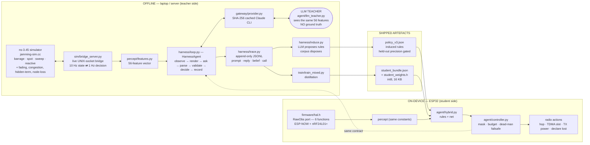
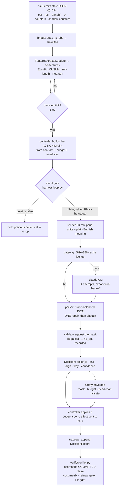

# Jamming Survival — system flow and user manual

How the setup is wired, how the pieces connect, and exactly how to run every stage by
hand. Companion files: `SCENARIOS.md` (all 540 scenarios executed) and `docs/DESIGN.md`
(the authoritative design).

---

## 1. Block diagram — what runs where

The single most important fact in this diagram: **the LLM exists only on the left, offline.
Nothing on the drone calls a model.**



**The sim-to-real seam is `RawObs`** — six functions in `firmware/hal.h`. Everything above
it (percept, rules, net, controller, safety) is shared byte-for-byte between simulation and
hardware. Only the source of the numbers changes: ns-3, or a real radio.

---

## 2. Code-flow DAG — one decision, end to end



**Three invariants worth knowing when reading the code**

1. *Information must be bought.* Spectrum data reaches the percept layer **only** after the
   agent pays for a `spectrum_scan`. Gate `N3` in `harness/verify_links.py` enforces it.
2. *One verifier.* refsim and ns-3 episodes are scored by the same `score_episode`, from the
   same `episode_log` shape. Two scorers would be two truths.
3. *The teacher never sees ground truth.* Gate `G6` (`tests/test_teacher_provenance.py`)
   fails the build if a ground-truth symbol appears in `agent/llm_teacher.py`, if any
   teacher artefact was produced against refsim rather than ns-3, or if a deployed module
   imports the privileged oracle.

---

## 3. User manual — running each stage by hand

All commands run from `capstone/`. Python 3.10+; `numpy`, `pyyaml` always; `scikit-learn`
only for training.

### 3.0 Prerequisites

```bash
# ns-3.45 with our scenario program
cp sim_ns3/jamming-sim.cc  <ns3>/scratch/jamming/
cp sim_ns3/mesh-node-app.* <ns3>/scratch/jamming/
cd <ns3> && ./ns3 build jamming-sim
export NS3_BIN=<ns3>/build/scratch/jamming/ns3.45-jamming-sim-optimized

# the teacher needs the Claude CLI on PATH (export CLAUDE_BIN to override)
claude --version
```

### 3.1 Check everything is wired before spending anything

```bash
make links     # architecture DAG, 13 links, includes the 4 live ns-3 ones
make gates     # G0 repo · G1 contract effects · G2 fidelity · G3 safety+rogue
               # G4 leakage · G5 Mode H self-test · G6 teacher provenance
```

`make links` is the one to run after any change to the world model. `N1` and `N2` are
regression tests for two bridge bugs that silently flattened the entire spectrum.

### 3.2 Rehearse the full teacher pipeline for free

```bash
make llm-stub          # whole path, stubbed model, CI-safe, ~20 s
```

Do this before any real run. It exercises bridge → percept → gate → parser → trace →
verifier without a single model call.

### 3.3 Run the LLM teacher against ns-3

```bash
# one family, two episodes — a smoke test that bills real calls
python3 harness/run_llm.py --families spot --per-family 2 --workers 4 \
    --provider claude --world ns3 --ns3 "$NS3_BIN" \
    --trace-dir ../data/traces/smoke --out ../data/smoke.json

# the full corpus, resumable
python3 harness/run_llm.py \
    --families barrage,spot,reactive,sweep,fading,node_loss,congestion,hidden_term,refusal \
    --per-family 60 --seed0 10000 --workers 12 \
    --provider claude --world ns3 --ns3 "$NS3_BIN" --resume \
    --trace-dir ../data/traces/llm_full --out ../data/llm_golden_full.json
```

- `--world ns3` is the **default**; refsim must be asked for explicitly.
- `--workers 12` is deliberate. At 32 workers 64.6% of calls failed with `claude exited 1`
  from contention; at 12 the failure rate is 0%.
- `--resume` skips episodes that already have a trace. Traces are written per episode, so a
  killed run loses nothing.
- If a run dies before writing its summary:
  `python3 harness/rescore_traces.py --traces ../data/traces/llm_full --log ../logs/full_teacher.log --world ns3 --out ../data/llm_golden_full.json`

### 3.4 Turn teacher traces into training rows

```bash
python3 train/llm_traces_to_rows.py --traces ../data/traces/llm_full \
    --split any --out ../data/traces_llm_full/all.jsonl
```

### 3.5 Induce the rule layer (the LLM proposes, the corpus disposes)

```bash
python3 harness/induce.py --out ../data/policy_v3.json --audit ../data/policy_v3_audit.json
```

Every candidate rule is measured on a held-out split; only those clearing the precision bar
survive, and rejects are recorded in the audit file rather than silently dropped.

### 3.6 Distil the student, calibrate, export for the ESP32

```bash
python3 train/train_mixed.py --out ../data/student_vX --llm ../data/traces_llm_full/all.jsonl --llm-weight 3
python3 train/calibrate_abstain.py --bundle ../data/student_vX/student_bundle.json \
    --calib ../data/traces_ns3/val.jsonl --ood ../data/traces_ns3/test.jsonl --write
python3 train/export_int8.py --bundle ../data/student_vX/student_bundle.json \
    --traces ../data/traces_ns3/val.jsonl --out ../data/student_vX
```

Calibrate on the **deployment** world (ns-3), never the pooled set — pooling with refsim
puts the error just under target and silently disables abstention.

### 3.7 Headline table and teacher→student agreement

```bash
python3 train/evaluate.py --world ns3 --ns3 "$NS3_BIN" \
    --arms baseline,teacher,student --limit-per-family 3 \
    --out ../data/headline_table.json
```

Add `--teacher-provider stub` to rehearse the teacher arm and the agreement metric for
free. `--with-oracle` adds the privileged oracle as a **ceiling** — it is constructed with
the true cause and is never a competitor.

### 3.8 On-device (Mode H)

```bash
make hal        # builds hal_host.c + hal_selftest.c, 15 checks, no hardware needed
```

Then follow `docs/HARDWARE_GUIDE.md` (stages H0–H5, ~₹1,100 minimum BOM). The student runs
rules-only first: `policy_v3.json` is ~30 lines of C and carries the transferable physics.

---

## 4. Cost notes

Measured over 332 real calls:

| | per teacher decision |
|---|---|
| our prompt (23-row panel + rules) | ~2,700 tokens |
| input tokens billed | **31,385** |
| output tokens | 2,423, of which **2,169 are extended thinking** |

`claude -p` is an agent CLI, not a completion endpoint: it ships its own system prompt and
tool catalogue on every invocation (~25 K cache-read), so our panel is ~9% of what is
billed. `MAX_THINKING_TOKENS` in the environment drives the thinking cost. Passing an
explicit `--system-prompt` cut output 649 → 193 tokens in a direct test. Both are worth
fixing before the next full run; they were **not** changed mid-run because the model and
system prompt are part of the cache key, and changing them would invalidate every cached
response and make late decisions differ in kind from early ones.
